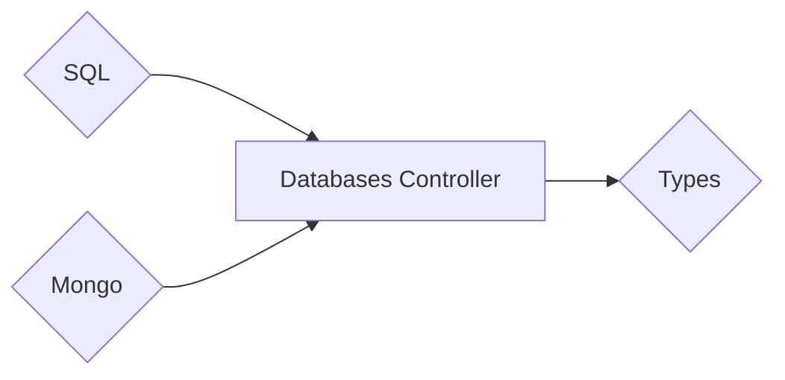

# Welcome to **DataBase-Controller (DBC)**

> **C.R.U.D — Operations** for **Mongo** and **SQL**. Designed to work with <a href="https://pypi.org/project/fastberry/" target="_blank">**`Fastberry`**</a>.
> But at the same time you can use the **"database-controller"** by itself as a **Standalone** tool.



## **Built** With:

| Core                                                                                | Tool                                                                              |
| ----------------------------------------------------------------------------------- | --------------------------------------------------------------------------------- |
| <a href="https://pypi.org/project/SQLAlchemy/" target="_blank">**`SQLAlchemy`**</a> | <a href="https://pypi.org/project/databases/" target="_blank">**`Databases`**</a> |
| <a href="https://pypi.org/project/pymongo/" target="_blank">**`PyMongo`**</a>       | <a href="https://pypi.org/project/motor/" target="_blank">**`Motor`**</a>         |

## **C.U.D** Methods

| Method       | Is Used To...                       | Variables              |
| ------------ | ----------------------------------- | ---------------------- |
| **`create`** | **Create** Single/Multiple Records. | `(dict or list[dict])` |
| **`update`** | **Edit** Single/Multiple Records.   | `(list[ID], dict)`     |
| **`delete`** | **Delete** Single/Multiple Records. | `(list[ID])`           |

## **Read (Multiple-Records)** Methods

| Method          | Is Used To...                                | Variables                                    |
| --------------- | -------------------------------------------- | -------------------------------------------- |
| **`all`**       | **All** Rows (**Multiple**-Records)          | `N/A`                                        |
| **`find`**      | **Custom-Querying** (**Multiple**-Records)   | `(query, page=1, limit=100, sort_by='-id')`  |
| **`filter_by`** | **Filter-By** Columns (**Multiple**-Records) | `(dict, page=1, etc... )`                    |
| **`search`**    | **Search** in Columns (**Multiple**-Records) | `(list[str(column)], value, page=1, etc...)` |

## **Read (One-Record)** Methods

| Method         | Is Used To...                                         | Variables      |
| -------------- | ----------------------------------------------------- | -------------- |
| **`get_by`**   | **Filter-By** Columns (**Single**-Record)             | `(**kwargs)`   |
| **`detail`**   | Get **Details** by **Encoded-ID** (**Single**-Record) | `(Encoded_ID)` |
| **`find_one`** | **Custom-Querying** (**Single**-Records)              | `(query)`      |

## **Util** Methods

| Method          | Is Used To...                                 | Variables |
| --------------- | --------------------------------------------- | --------- |
| **`id_decode`** | **Decode** Encoded-ID                         | `(str)`   |
| **`Q`**         | **Custom-Querying** for **SQLAlchemy** Tables | `N/A`     |

## Database **Type | Model** Setup

| Key                   | Description                                                                           |
| --------------------- | ------------------------------------------------------------------------------------- |
| **`table_name`**      | (**`str`**) — Custom **Table Name** for the database                                  |
| **`primary_key`**     | (**`list[str]`**) — Columns that are consider **Primary Key**                         |
| **`required`**        | (**`list[str]`**) — Columns that **Required** an input                                |
| **`index`**           | (**`list[str]`**) — Columns that are **Index**                                        |
| **`unique`**          | (**`list[str]`**) — Columns that are **Unique**                                       |
| **`unique_together`** | (**`list[tuple]`**) — Group of Columns that are **Unique Together**                   |
| **`ignore`**          | (**`list[str]`**) — Columns that are **Virtual** and not part of the database columns |

## Usage **Example**

> These configurations are for **SQL-Database (ONLY)**

```python title="model-sample.py"
# -*- coding: utf-8 -*-
"""
    Model-Setup-Sample
"""

import dbcontroller as dbc

# Model
sql = dbc.Controller(sql="sqlite:///example.db")

@sql.model(
    table_name="custom_table_name",
    primary_key=["col_one"],
    required=["col_one"],
    index=["col_one"],
    unique=["col_one"],
    unique_together=[("col_one", "col_two")],
    ignore=["col_three"],
)
class Product:
    name: str
```
